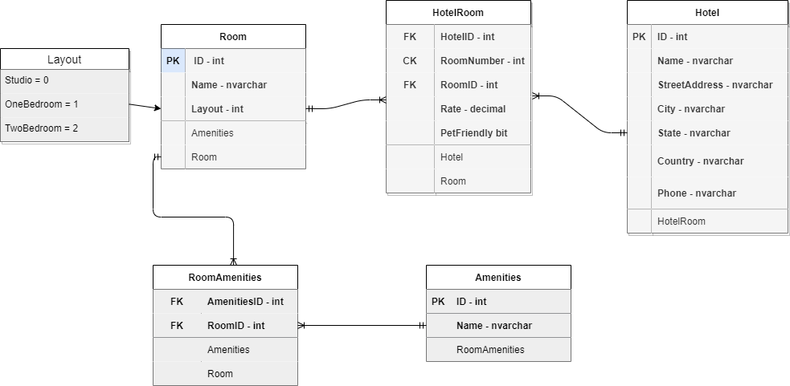

# Async-Inn

> A database for an imaginary hotel chain.

By: Joshua Haddock

## Table of Contents

* [General Info](#general-information)
* [Technologies Used](#technologies-used)
* [Features](#features)
* [Media](#media)
* [Table Explanation](#table-explanation)
* [Setup](#setup)
* [Usage](#usage)
* [Project Status](#project-status)
* [Room for Improvement](#room-for-improvement)
* [Acknowledgements](#acknowledgements)
* [Contact](#contact)
* [License](#license)

## General Information

1. For the first part of this lab we are simply creating and ERD model for a made up hotel chain. This a practice in designing the architecture of relational databases.

2. For the second day of lab we created out database with models and controllers for Amenities, Rooms, and Hotels. We also created a DbContext for AsyncInn which included modelBuilder.

## Technologies Used

* C# 9.0
* .Net 5

## Features

* A completed ERD diagram.
* Three working models with controllers capable of seeding new data to the database.

## Media

## Table Explanation

### Hotel

Locations is a class which holds the properties Name, City, State, Address, and PhoneNumber. All of these are VarChar except PhoneNumber, which is an int.

Connected to HotelRoom.

### HotelRoom

Has composite Foreign Key or HotelID and RoomID, and create a composite key called RoomNumber. It has the properties of Rate(decimal) and PetFriendly(bit).

Connected to Hotel/Room.

### Room

Has an ID, Name(string) and Layout(int). Layout receives data from a connected enum list.

Is connected to Layout/RoomAmenities.

### Layout

List of three room type: Studio, OneBedroom, and TwoBedroom. Connects to Room and nothing else.

### RoomAmenities

Feeds into Room. and receives its ID. Also receives Amenities ID.

### Amenity

Simple class with just an ID and a Name property.

## Setup

Nothing to set up yet.

## Usage

Educational purposes. This project was built in order to experiment with database creation.

## Project Status

In Progress

## Room for Improvement

To do:

## Acknowledgements

## Contact

Created by [Joshua Haddock](https://www.linkedin.com/in/joshuahaddock/) - feel free to contact me!

## License

This project is open source and available under the [MIT License](./LICENSE).

